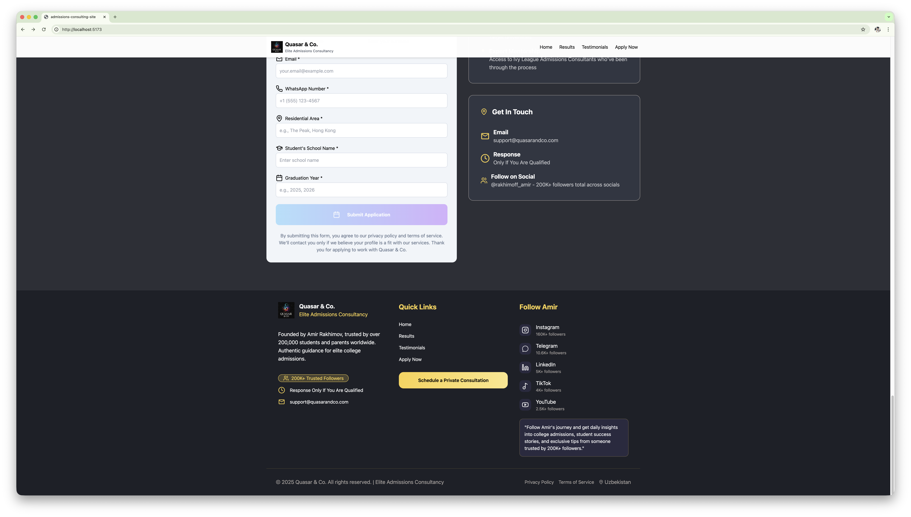

# Quasar & Co. — Admissions Consulting Website

This project is a frontend website built to showcase an admissions consulting service, including a landing page, results section, testimonial layout, and a fully functional application form.

The design focuses on a clean, high-end aesthetic similar to modern consulting and education agencies.

---

## Screenshots

### Homepage


### Application Form


### Footer Section


---

## Features

### Landing Page
- Hero banner with headline, founder image, and social statistics  
- Highlight section showing credibility and achievements  
- Call-to-action button leading to the application page  

### Application Form
- Role selection (Parent / Student)  
- Input validation  
- Submit button with loading/animation style  
- Custom modal to preview submitted data  

### UI/UX
- Fully responsive layout  
- TailwindCSS styling  
- Smooth spacing, container layout, and typography  
- Clean dark theme sectioning for readability  

### Modal Component
- Opens using ref  
- Supports clicking outside to close  
- 80vh height limit with internal scroll  
- Accepts HTML content or React nodes  

---

## Technologies Used

- React + TypeScript  
- Vite  
- TailwindCSS  
- React Icons  
- Custom Modal Component  
- Local assets for UI rendering  

---

## Getting Started

### Install dependencies

```bash
npm install
````

### Run development server

```bash
npm run dev
```

### Allow local network access (LAN)

```bash
npm run dev -- --host
```

Visit from another device on the same network:

```
http://YOUR_LOCAL_IP:5173
```

---

## Folder Structure

```txt
src/
│── components/
│   ├── Header.tsx
│   ├── Footer.tsx
│   ├── Modal.tsx
│── pages/
│   ├── Home.tsx
│   ├── Apply.tsx
│── static/
│   └── assets/
│       ├── home.png
│       ├── apply.png
│       ├── footer.png
│── App.tsx
│── main.tsx
```

---

## How The Form Works

When the user submits the form:

* Data is collected using refs
* A modal opens with the submitted information
* Form data structure example:

```json
{
  "role": "parent",
  "name": "John",
  "surname": "Doe",
  "email": "john@example.com",
  "whatsapp": "+1 555-123-4567",
  "country": "Hong Kong",
  "schoolName": "HKIS",
  "graduationYear": "2026"
}
```

---

## License

This project is available under the MIT License.